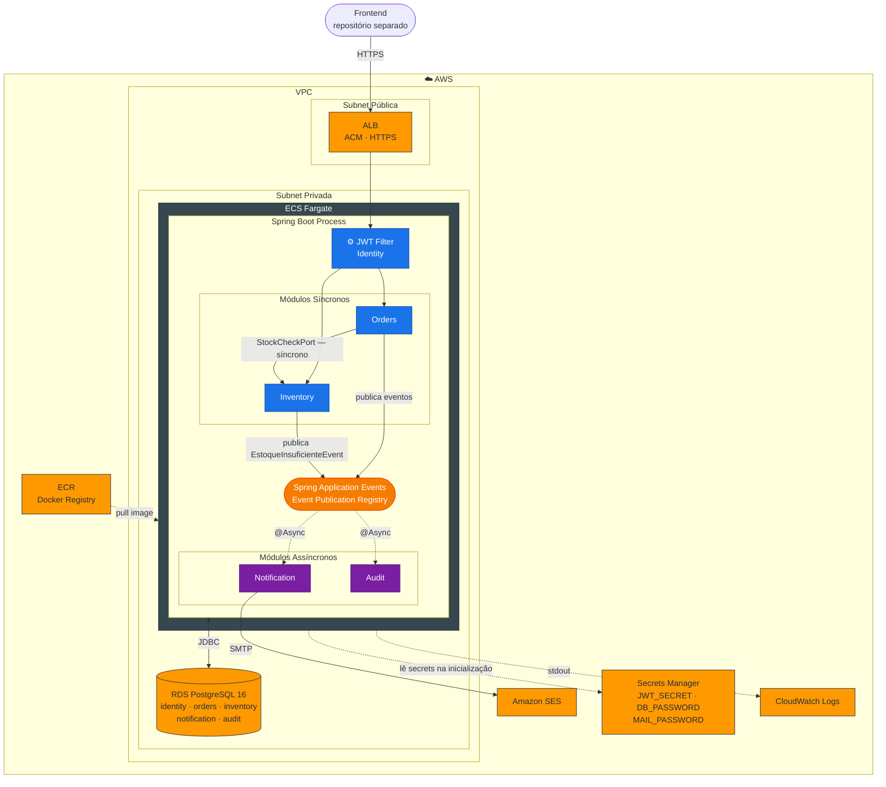

# Internal Parts Portal — API

Portal web para solicitação, aprovação e acompanhamento de pedidos de peças industriais internas, com controle de estoque integrado.

Colaboradores solicitam peças diretamente no sistema, aprovadores avaliam os pedidos e almoxarifes executam a separação — eliminando o fluxo por e-mail e dando rastreabilidade completa ao processo.

---

## Stack

- **Java 21** · Spring Boot 4.x
- **Spring Modulith** — arquitetura modular com limites enforçados em tempo de teste
- **Spring Security** — autenticação via JWT
- **PostgreSQL 16** — schemas separados por módulo
- **Flyway** — migrations versionadas
- **Testcontainers** — testes de integração com PostgreSQL real
- **Docker Compose** — ambiente local (PostgreSQL + Mailhog)

---

## Módulos

| Módulo | Responsabilidade |
|---|---|
| **Identity** | Autenticação JWT, gerenciamento de usuários e roles |
| **Orders** | Ciclo de vida dos pedidos: criação, aprovação, rejeição e conclusão |
| **Inventory** | Catálogo de peças, controle de estoque e reservas |
| **Notification** | Envio de emails em resposta a eventos de domínio (assíncrono) |
| **Audit** | Registro imutável de todos os eventos de domínio (assíncrono) |

Notification e Audit são **consumidores puros** — nunca recebem chamada direta, apenas ouvem eventos publicados pelos demais módulos.

---

## Diagrama Arquitetural



---

## Fluxo principal

```
COLABORADOR cria pedido
  → validação síncrona de estoque (Orders → Inventory)
  → status: PENDENTE

APROVADOR aprova ou rejeita
  → aprovado: Inventory reserva estoque · Notification avisa almoxarife
  → rejeitado: Inventory libera reserva · Notification avisa solicitante

ALMOXARIFE conclui separação física
  → Inventory decrementa estoque definitivamente
  → status: CONCLUIDO
```

---

## Roles

| Role | Permissões |
|---|---|
| `COLABORADOR` | Cria pedidos, acompanha os próprios |
| `APROVADOR` | Visualiza fila de pendentes, aprova ou rejeita |
| `ALMOXARIFE` | Visualiza aprovados, conclui separação, gerencia estoque |
| `ADMIN` | Gerencia usuários e catálogo de peças |

---

## Rodando localmente

**Pré-requisitos:** Java 21, Docker

**1. Configure o ambiente**

```bash
cp .env.example .env
# edite .env: defina DB_PASSWORD e JWT_SECRET (mínimo 256 bits)
```

**2. Suba o banco e o Mailhog**

```bash
docker-compose up -d
```

**3. Execute a aplicação**

```bash
# Windows
mvnw.cmd spring-boot:run

# Linux / macOS
./mvnw spring-boot:run
```

A API estará disponível em `http://localhost:8080`.  
O Mailhog (captura de emails) estará em `http://localhost:8025`.

---

## Testes

```bash
# Windows
mvnw.cmd test

# Linux / macOS
./mvnw test
```

Os testes de integração sobem um container PostgreSQL automaticamente via Testcontainers — nenhuma configuração adicional necessária.

---

## Documentação

| Documento | Descrição |
|---|---|
| [`docs/initial-context.md`](docs/initial-context.md) | Contexto do domínio, eventos e requisitos funcionais |
| [`docs/PRD.md`](docs/PRD.md) | Product Requirements Document com módulos, endpoints e critérios de aceite |
| [`docs/adr/ADR-001`](docs/adr/ADR-001-spring-modulith.md) | Decisão: Spring Modulith sobre microserviços |
| [`docs/adr/ADR-002`](docs/adr/ADR-002-event-publication-registry.md) | Decisão: Event Publication Registry sobre broker externo |
| [`docs/adr/ADR-003`](docs/adr/ADR-003-aws-deploy.md) | Decisão: Deploy na AWS |
